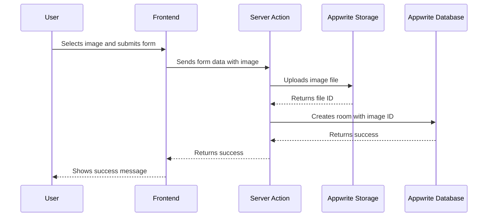

This is a [Next.js](https://nextjs.org/) project bootstrapped with [`create-next-app`](https://github.com/vercel/next.js/tree/canary/packages/create-next-app).

## Getting Started

First, run the development server:

```bash
npm run dev
# or
yarn dev
# or
pnpm dev
# or
bun dev
```

Open [http://localhost:3000](http://localhost:3000) with your browser to see the result.

You can start editing the page by modifying `app/page.js`. The page auto-updates as you edit the file.

This project uses [`next/font`](https://nextjs.org/docs/basic-features/font-optimization) to automatically optimize and load Inter, a custom Google Font.

## Learn More

To learn more about Next.js, take a look at the following resources:

- [Next.js Documentation](https://nextjs.org/docs) - learn about Next.js features and API.
- [Learn Next.js](https://nextjs.org/learn) - an interactive Next.js tutorial.

You can check out [the Next.js GitHub repository](https://github.com/vercel/next.js/) - your feedback and contributions are welcome!

## Deploy on Vercel

The easiest way to deploy your Next.js app is to use the [Vercel Platform](https://vercel.com/new?utm_medium=default-template&filter=next.js&utm_source=create-next-app&utm_campaign=create-next-app-readme) from the creators of Next.js.

Check out our [Next.js deployment documentation](https://nextjs.org/docs/deployment) for more details.

# Room Booking System - Appwrite + Next.js


A modern room booking system built with Next.js 14 and Appwrite backend. This application allows users to discover, book, and manage meeting rooms while ensuring no overlapping bookings occur.

## Features

- 🔐 **User Authentication** - Secure login/registration with Appwrite
- 🏢 **Room Management** - Full CRUD operations for rooms
- 📅 **Smart Booking System** - Prevents overlapping bookings
- 🔍 **Room Discovery** - Browse available rooms with filters
- 📱 **Responsive Design** - Works on mobile, tablet, and desktop
- 🔄 **Real-time Updates** - Instant UI updates with Appwrite real-time
- 📊 **Dashboard** - View your bookings and manage rooms

## Technologies Used

- **Frontend**: Next.js 14 (App Router)
- **Backend**: Appwrite (Database, Storage, Auth)
- **UI**: Tailwind CSS
- **State Management**: React Context API
- **Form Handling**: React DOM Form Actions
- **Notifications**: React Toastify

## Getting Started

### Prerequisites

- Node.js v18 or higher
- Appwrite account (free tier available)
- Git

### Installation

1. **Clone the repository**:

   ```bash
   git clone https://github.com/your-username/room-booking-system.git
   cd room-booking-system
   ```

2. **Install dependencies**:

   ```bash
   npm install
   ```

3. **Set up environment variables**:
   Create a `.env.local` file in the root directory with your Appwrite credentials:

   ```env
   NEXT_PUBLIC_APPWRITE_PROJECT_ID=your-project-id
   NEXT_PUBLIC_APPWRITE_ENDPOINT=https://cloud.appwrite.io/v1
   NEXT_PUBLIC_APPWRITE_DATABASE=your-database-id
   NEXT_PUBLIC_APPWRITE_COLLECTION_ROOMS=your-rooms-collection-id
   NEXT_PUBLIC_APPWRITE_COLLECTION_BOOKINGS=your-bookings-collection-id
   NEXT_PUBLIC_APPWRITE_STORAGE_BUCKET_ROOMS=your-storage-bucket-id
   APPWRITE_API_KEY=your-api-key
   ```

4. **Run the development server**:

   ```bash
   npm run dev
   ```

5. **Open in your browser**:
   ```
   http://localhost:3000
   ```

## Appwrite Setup

### Required Collections

1. **Rooms Collection**:

   - Attributes:
     - name (string, required)
     - description (string)
     - sqft (number)
     - capacity (number)
     - location (string)
     - address (string)
     - availability (enum: available, unavailable)
     - price_per_hour (number)
     - amenities (string)
     - image (string, file ID)
     - user_id (string, user ID)

2. **Bookings Collection**:
   - Attributes:
     - room_id (string, relationship to Rooms)
     - user_id (string, user ID)
     - check_in (datetime)
     - check_out (datetime)
     - status (enum: pending, confirmed, cancelled)

### Indexes

For the Bookings collection, create these indexes for efficient conflict checking:

```json
[
  {
    "key": "room_id",
    "type": "key",
    "attributes": ["room_id"]
  },
  {
    "key": "check_in",
    "type": "key",
    "attributes": ["check_in"]
  },
  {
    "key": "check_out",
    "type": "key",
    "attributes": ["check_out"]
  }
]
```

## Project Structure

```
room-booking-system/
├── app/
│   ├── actions/               # Server actions
│   │   ├── createRoom.js
│   │   ├── updateRoom.js
│   │   ├── createBooking.js
│   │   └── ...
│   ├── components/            # Reusable components
│   │   ├── RoomCard.js
│   │   ├── BookedRoomCard.js
│   │   └── ...
│   ├── context/               # Context providers
│   │   └── AuthContext.js
│   ├── pages/                 # Page components
│   │   ├── login/
│   │   ├── register/
│   │   ├── bookings/
│   │   └── ...
│   └── layout.js              # Main layout
├── config/                    # Configuration files
│   └── appwrite.js
├── public/                    # Static assets
├── middleware.js              # Authentication middleware
└── package.json
```

## Key Functionality

### Preventing Overlapping Bookings

The system ensures no two bookings overlap for the same room using this logic:

```javascript
async function createBooking(roomId, checkIn, checkOut) {
  const { databases } = await createAdminClient();

  // Check for existing bookings
  const existingBookings = await databases.listDocuments(
    process.env.NEXT_PUBLIC_APPWRITE_DATABASE,
    process.env.NEXT_PUBLIC_APPWRITE_COLLECTION_BOOKINGS,
    [
      Query.equal("room_id", roomId),
      Query.lessThanEqual("check_in", checkOut),
      Query.greaterThanEqual("check_out", checkIn),
    ]
  );

  if (existingBookings.total > 0) {
    throw new Error("This room is already booked for the selected time period");
  }

  // Create new booking
  await databases.createDocument(/* ... */);
}
```

### Image Upload Flow



## Deployment

### Vercel Deployment

1. Push your code to a GitHub repository
2. Create a new project in Vercel
3. Connect your GitHub repository
4. Add environment variables in Vercel settings
5. Deploy!

### Appwrite Configuration for Production

1. Add your production domain to Appwrite project settings
2. Configure CORS for your Vercel domain
3. Set up SSL certificates
4. Enable email-based authentication

## Contributing

Contributions are welcome! Please follow these steps:

1. Fork the project
2. Create your feature branch (`git checkout -b feature/AmazingFeature`)
3. Commit your changes (`git commit -m 'Add some AmazingFeature'`)
4. Push to the branch (`git push origin feature/AmazingFeature`)
5. Open a Pull Request

## License

Distributed under the MIT License. See `LICENSE` for more information.

## Contact

Your Name - [@yourtwitter](https://twitter.com/yourtwitter) - your.email@example.com

Project Link: [https://github.com/your-username/room-booking-system](https://github.com/your-username/room-booking-system)
